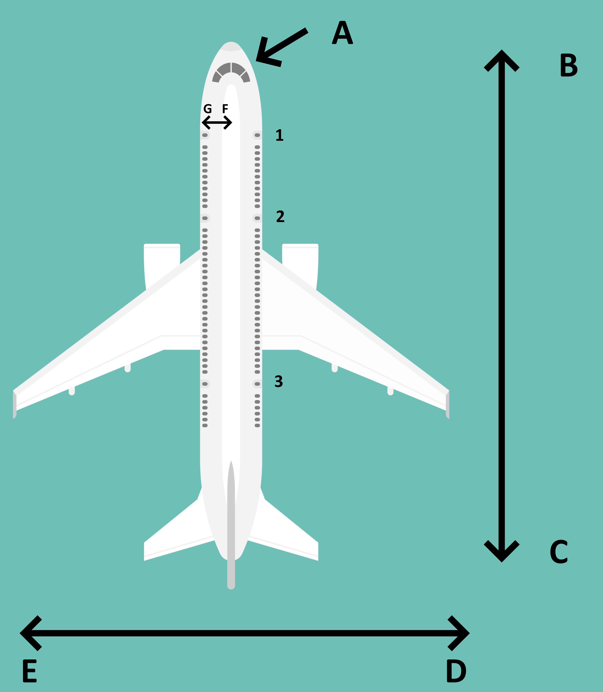

- 
- A: Cockpit (Sempre o ponto de referência)
- B: Forward (Frente)
- C: Afterward/Back (Trás)
- D: Right (Direita)
- E: Left (Esquerda)
- G: Outbound
- F: Inbound
-
- As portas de emergência são numeradas a partir do cockpit.