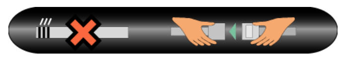

- Passenger Information Unit (Painel Informativo para Passageiros)
- {:height 79, :width 369}
- Desligado e ligado individualmente no cockpit
- Ambas a luzes se acendem automaticamente se #[[Altitude de Cabine]] chegar aos 14,000"