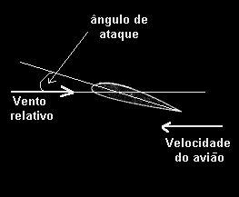

- Ângulo formado entre a #Asa e a direção do vento relativo ou trajetória do voo
- 
- Quanto maior a velocidade, maior a #Sustentação
- Quanto maior o ângulo de ataque, maior a #Sustentação
	- Mas se o ângulo de ataque for muito elevado, a asa entra em #Stall